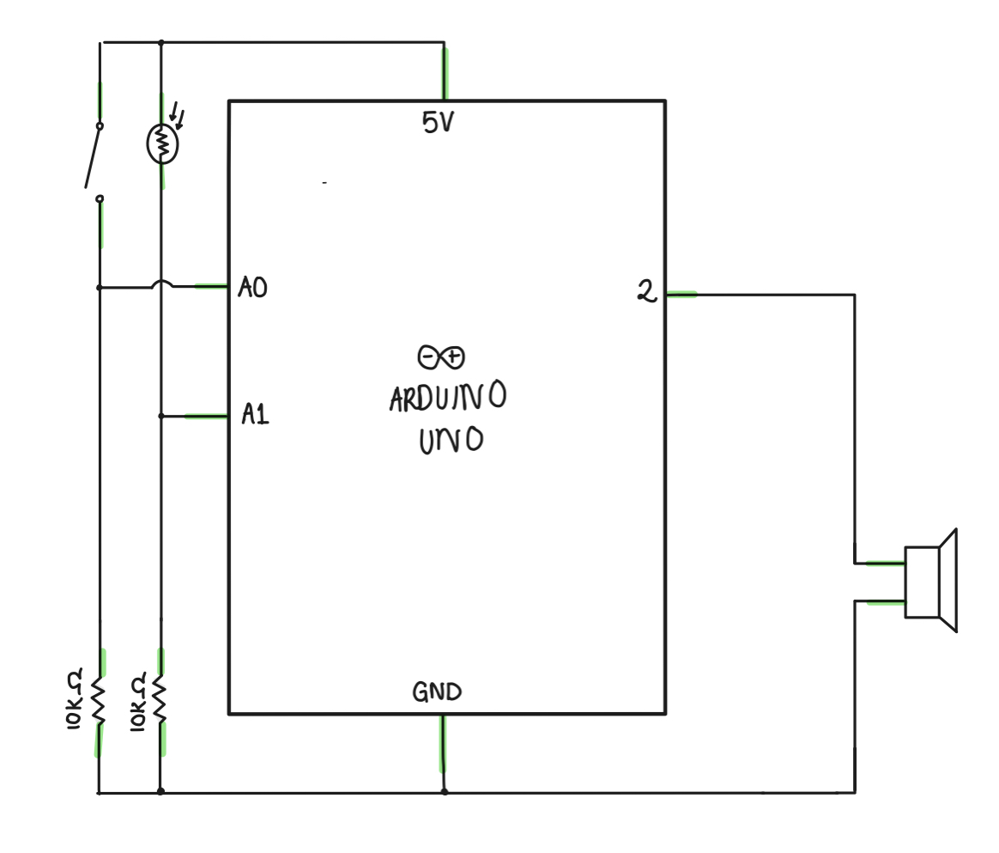

# MUSICAL INSTRUMENT: Pitch Perfect!

## Final Product:

  

Click [here](https://youtu.be/8TJpZRYX2aI) for a video demo.

## Idea:

I wanted to make the simplest thing possible this time just because the coding part for the sound is much harder than I aniticpated. This instrument is called Pitch Perfect, in which it plays a certain tune. The tune can only be played when the digital switch is pressed down. Alongside the playing tune, I used the photoresistor to change the pitch of the tune. Depending on the values read by the photoresistor I was able to make an instrument by playing on the same tune, thereby using the tune itself as an instrument and a part of the project.

## Execution:

The schematic and breadboard were very easy this time, however the code was very exhausting. It's a lot of info at once and it takes a while to get to understand it, but that can be easily remedied with more practice. The code took a lot of trial and error.

## Schematic:

   

Simple schematic but super affective.

## Difficulties:

  - Everything about sounds coding is difficult, but I easily managed. 
  - I came across one specific point that took me a while to figure out. When I first wired my breadboard, I had inserted a resistor for the speaker port. The sound was extremely faint was illegible. A quick ask around and I figured that removing the resistor would allow more electron flow therefore the sound was restored.
 
 ## Take-away: 
 
 Fun little melody, the kids at our house loved it <3

