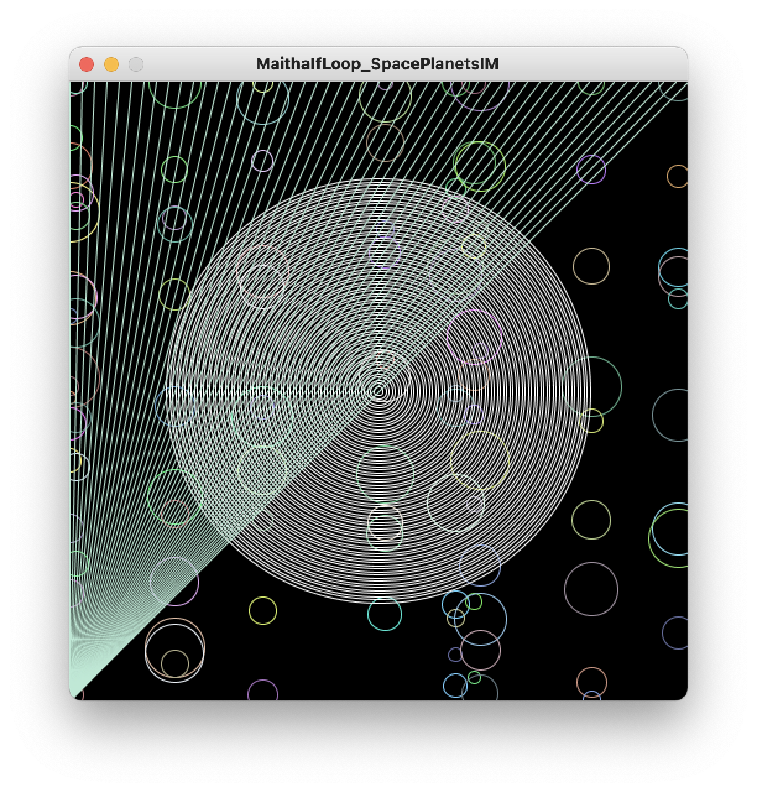

# Looped Art

### Inspiration:

Initially looking at the reference/inspiration pictures the Professor included, I felt a certain lack of confidence knowing how difficult it would be to execute a pattern as complex as the examples. It took a while to be inspired, but eventually our little sky friend, the MOON, inspired me to try and recreate cosmic patterns using repetitive loops. Therefore my humble art piece consists mainly of an abstracted line art effect. A moon in the middle. Rays shooting from the left of the screen resembling what is in my mind sun rays making their way to illuminate its partner, our moon. And lastly since I realised adding stars would be a hassle, I prefered to go with planets. I am quite happy with the little scene of nature I was able to capture with code, it reaffirmed me that I can indeed recreate beauty even in its simplest form.

### General Thoughts during Execution:

In terms of difficulty, I found that coming up with inspiration was much more difficult than the code execution itself. Nevertheless, I am quite well acquainted with coding and for() and while() loops therefore it is not much of a shock that I was able to figure my way out with them. I incorporated a nested for() loop in creating the random planets on screen around the moon, which was fun in itself to figure out. The only "difficult" thing that I had to deal with was trying to figure out which attributes were which for the 2D primitive shapes. I do recognise that they are floats and the number of attributes I would need for each shape, but connecting with attribute is for what was difficult to remember without the Processing Reference Page.

# Final Product:

*Side Note: As I used a lot of randomisation in this code work, this is but an example of one of those randomisations.*

