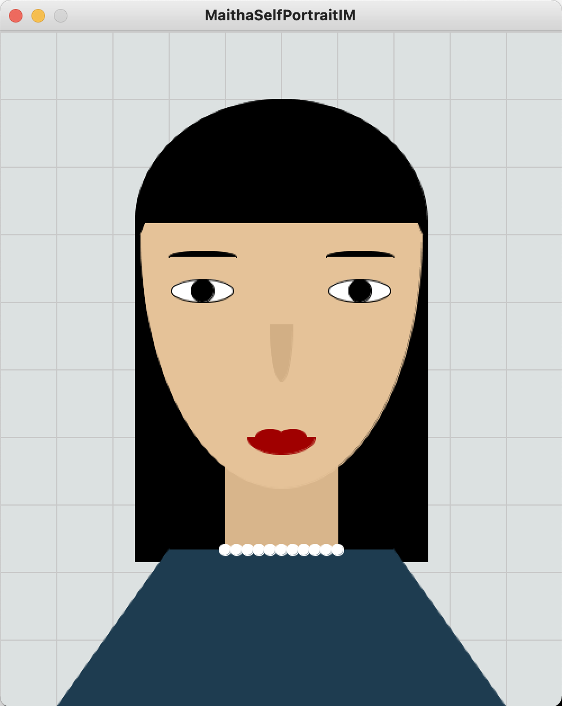

# Self Portrait:

As soon as I started the assignment, I realised it was a crucial step to define how and where I can reference the different facial features to stand in the collective of the final image. Luckily, I had taken Introduction to Computer Science in my freshman year and one of our first steps in creating any game was to set up a grid for the likes of Tic-Tac-Toe. 

I realised it would be beneficial to apply the same concept here as a background reference for different areas of the image. Had I not created a grid, this assignment would have been extremely difficult to produce with the exact symmetry I was able to achieve from the grid. Grid lines were my go-to at knowing at what height and width should an ellipse/rectangle/triangle be. It made the whole execution of the project much easier.

# Final Product:

