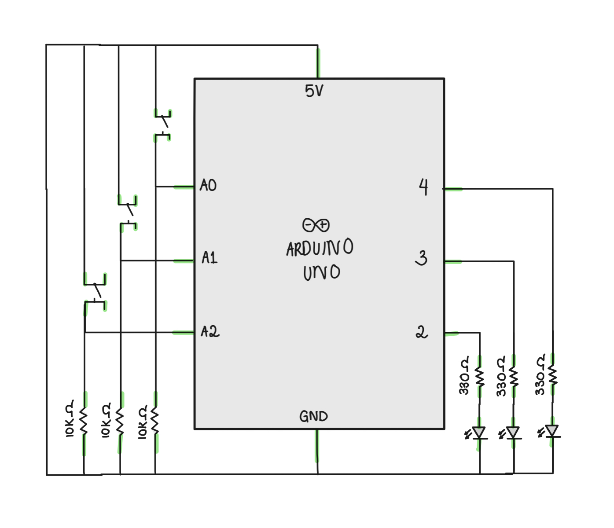

# LED & Switch Puzzle: Find the Light Party!

## Final Product:

  

## Idea:

I wanted to make a simple light game continued from the small excercise that was done in class. I love puzzles that require me to look for combinations and pick locks trying to figure out the winning scheme. So I took that idea and applied it here, especially since the code was a little simpler to digest as we are still getting into the arduino world. 

The game goes as follows: there are three switches and three lightbulbs, the switches each correspond to something on the bulbs either a pair of two lighting up or one random one. The goal is to figure out which combination of switches gets the flashing lights of a win. Hence the name of the game: Find the Light Party!

## Execution:

This execution was relatively easier than I expected. Although drawing my own schematic was a little confusing to get into at first, I managed to figure it out relatively quickly and I think i'll keep the exact same layout throughout my schematics in the semester. Keeping true to the wires was also fun to do: red for 5v, black for gnd, and maintaining a rhythm in the wires chosen for each set of objects to keep things clear. 

## Schematic:

   

For the schematic, I wanted to make a very simplified diagram that looks very similar to the one in the lecture notes. I tried maintaining the switch, resistor, and LED keys throughout and followed the green connection highlights that were on the one showed in the lecture notes. In the beginning, I included all the ports, inputs and outputs, like the one shown in class, but it got very messy very quickly so I kept with only the ports I used which in the end was easier for me to follow and keep track of. 

## Difficulties:

  - The first difficulty I came across was making the schematic before the arduino, I like trial and error so I ditched that and went straight for the board, then drew up my results after cleaning it up and organising it.
  - While running the arduino, I initially kept forgetting to add the 5v wires, I forgot them in class and I did so here again. I need to focus on that a bit more. And maintaining wiring the 5v to every switch was confusing at times but when I figured it out, I realised how easy it was all along. Rows not Columns is the motto!
  - My final problem was with the switches, I wired the 5v incorrectly in reference to the Inputs of A0, A1, A2 for the switches, it took a while to figure out the reference points of a switch but the example program called *DigitalRunSerial* helped me figure out the references of my switch. From the serial port I saw that my switch was always referencing 1 i.e. it was on even when not pressed which was then realised to be a wiring problem, once I fixed that the switches went back to normal. Giving 1 when pressed and 0 when not.
 
 ## Take-away: 
 
 This was pretty enjoyable to make. <3 

