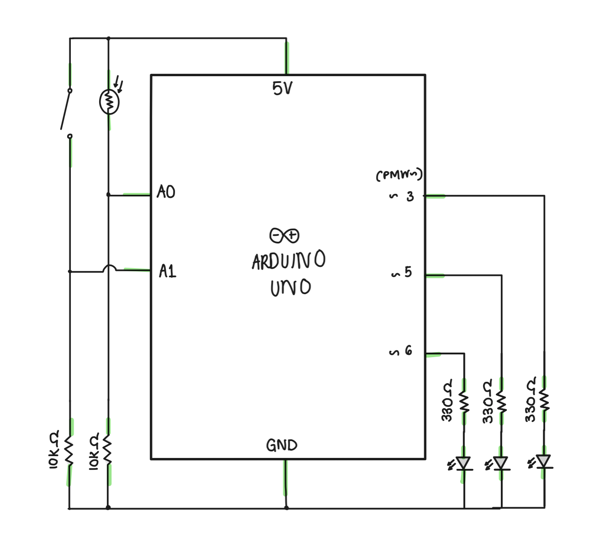

# ANALOG & DIGITAL: Code Blue: Resuscitate!

## Final Product:

  

## Idea:

I wanted to make a simple light simulation influenced by medical code blues. In this simulation the light represents the heartbeat. The heart is hooked on a machine (digital switch) which has to be pressed by the participant to get heartbeats (LIGHTS). Furthermore, the participant has to keep their finger on the analog light sensor as a simulation of CPR and revival, when the participant removes their finger from the sensor, the heartbeats slow and the light slightly dims. There is no winning but the player just has to keep on reviving the patient before they die out: CODE BLUE!

## Execution:

This execution was relatively more difficult than I expected. Drawing my own schematic was a little easier this time, but the code was complicated, I had to change my idea a couple of times because I could not figure out the code. Nonetheless, I did arrive at a fun game by the end of it. I kept the code simple because the arduino board itself was confusing me much more this time. 

## Schematic:

   

I still continue to make the schematic after the project, it's hard to visualise it beforehand.

## Difficulties:

  - While running the arduino, I had to check the **Examples < Basics < Analog and Digital Serial Readers** to help me check whether my switch and sensor were wired correctly, it took me a few hours to figure out that my resistor was put in the wrong place.
  - My other problem was with keeping the lights flashing, I tried a few combinations but this was the only one that worked for me, but nevertheless it felt the most rewarding because it does feel like real heartbeats.
 
 ## Take-away: 
 
 Not as enjoyable to make as the last one. T_T 
