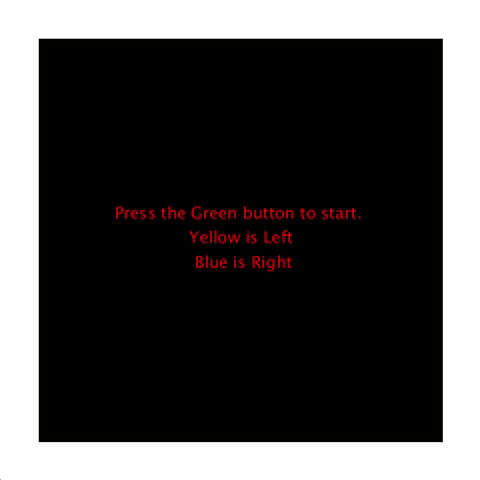
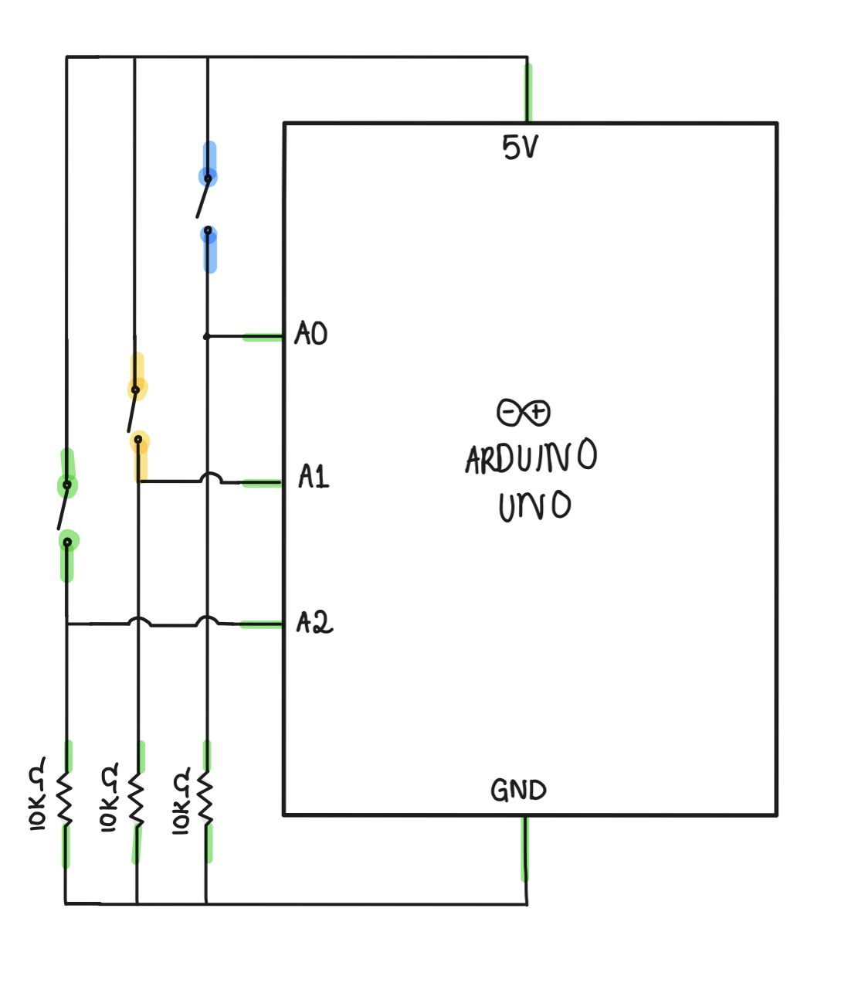

# FINAL PROJECT: Feed The Dragon!

## Final Product:

  

## Idea:

I wanted a simple game for my final, involving the communication ports between arduino and processing. I particularly enjoyed the basket catching games and I think they perfectly combine processing code with arduino. I wanted dragons to be my theme therefore I tried as best as I can to get that to work. 

## Execution:

The schematic and breadboard were very easy this time, however the code was very exhausting. It's a lot of info at once and it takes a while to get to understand it, but that can be easily remedied with more practice. The code took a lot of trial and error as well as multiple weeks to finish. I have to admit my lack of attendance did really take a toll on me as I just wanted to get the easiest thing done instead of focus my energy on it properly. I think I completely understand the serial connection to Processing, that became easy and I used the code from class to implement it. I made arduino switches less confusing this time as I keep mixing up and not knowing how to press among the wires each time so I tried avoiding that problem.  

## Schematic:

   

Simple schematic but super affective. I GOT THE HANG OF THEM!

## Breakdown:
   
   - **Day 1:** I focused on coming up with a plan, how many switches I'll use and what other input modes on arduino. I figured the easiest would be to use switches.
   - One switch starts the game, the other two switches to control the arduino. I wanted some sort of left-right moving paddle, so I looked at two options.
   - Option 1 was a bouncing ball that deflects on the paddle, Option 2 was the one I ultimately went with, simply because applying a theme to it was easier.
   - **Day 2:** I worked on the Processing code for a few days here. It took much longer than I expected but it was ultimately easy I would say.
   - I simply do not have the coding brains for a code this complicated with what's going on in life haha, so I consulted my best friend who is a computer science major and worked with her through it. She mainly helped me when I got stuck, otherwise I tried doing most of it on my own.
   - **Day 3:** I built the arduino and arduino code and connected it to my program.
   - **Day 4:** I worked on aesthetics and finalised the project.I switched all my objects to images and played around with the background and sound.

 
 ## Take-away: 
 
 My little sister won't stop playing it <3
