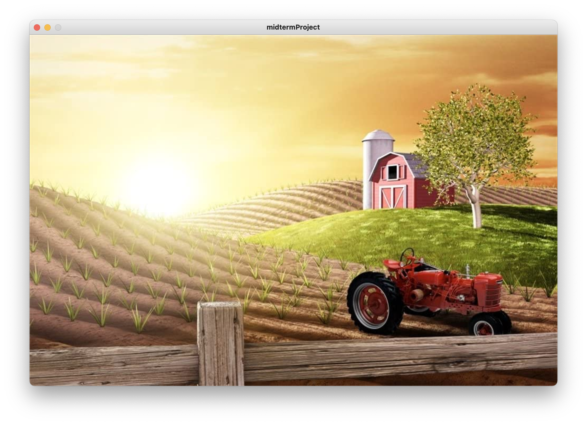
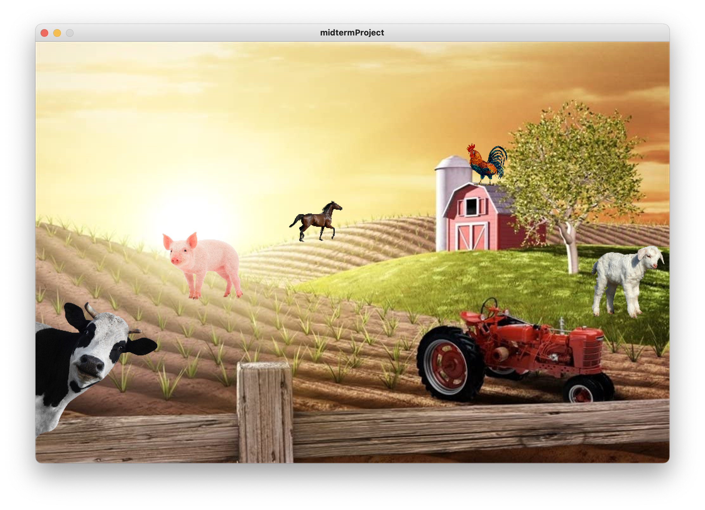
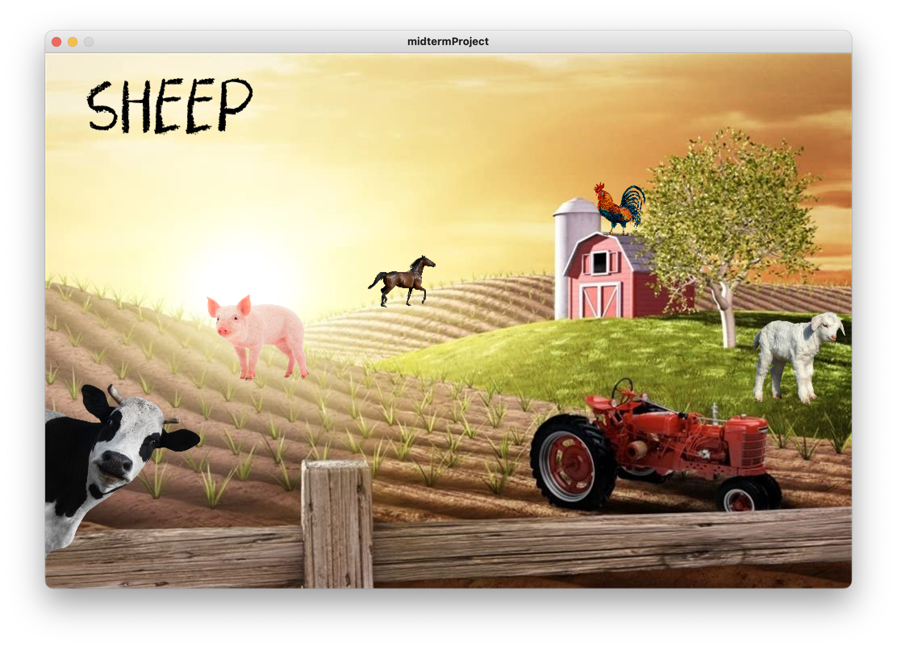
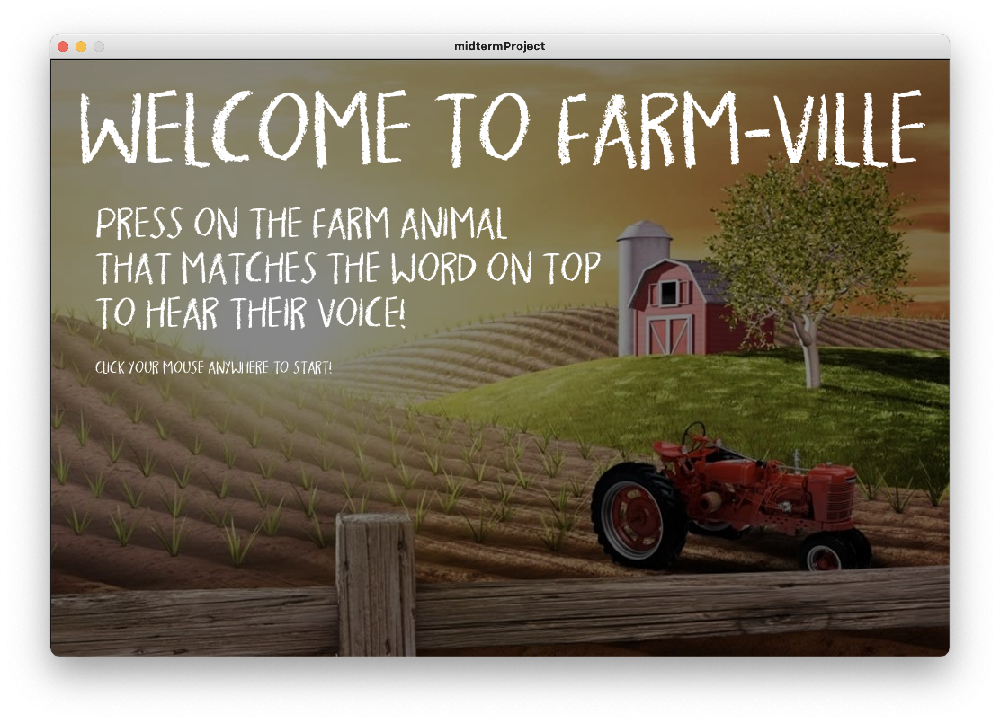
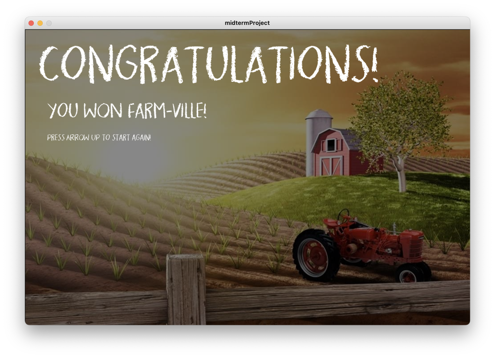

# FARM - VILLE

The game Farm-Ville is a kids learning game icorporating sound image and text. Kids will learn to identify words and relate them to their corresponding attributes. If the game displays "COW" the kid has to press on the right animal to win the game, else a buzzer sounds off informing the kid of the error.
 
 ### INSTRUCTIONS
 
 - Game starts with an instructions screen. Press Enter to start game.
 - A scene of farm animals is presented with a word on the TOP LEFT CORNER.
 - Player must press on the animal that correspond with the word to win.
 - If the correct animal is not pressed a losing sound plays.
 
 *- If the correct animal is pressed a winning sound plays & the animal word is popped out of the Array List.*
 
 *I wasn't able to do this so I turned the game into one level that restarts after every win instead of getting all 5 animals correctly. I asked for help but it seemed that approaching Array commands wasn't very friendly to me. Therefore new instruction:*
 
 - If the correct animal is pressed a winning page pops up.
 - When win page pops up, player can restart the game by pressing ARROW UP.
 - The game goes for one level at a time, it is meant for kids therefore trial and error is only performed with sounds.

# Progress

#### Thursday Feb 18, 2021

Today's work was simple, I only researched how I was going to execute this project, I looked for other people's recreations of this app and saw how they went about recreating it. What their code looked like and what programs they used. I also scouted the images I wanted to go with and edited them to fit my preference.

#### Monday Feb 22, 2021

I took a break from working on the Project as other work got stressfull, but today I worked on the background, I am still scouting for sound, quite confused as to whether use a Star Wars soundtrack as a background or not (Most probably will). I also inserted the typeface I am going to be using it is called *Krungthep* which is quite on brand with the theme. I have the saber count ready, that took a long while to figure out. I used arrays to do it. I have played with the Saber and Planet positioning but have not executed any code on them yet. 

#### Wednesday Feb 24, 2021

I've finished 30% of the Saber Strike code but I do not know how to move further with it, I scowered the internet for help videos and information or implementations of the game but it all seemed highly complicated even at my level of having a little coding background (I failed computer science twice :( ). I switched gears and am now doing a simpler game of identifying animals made for kids to play with, it is easier to manage as my background in coding only spans Python which has a complete different and much simpler syntax to Java. I've decided to keep the work simple as I wanted to really test my ability at understanding code properly and documenting it nicely.

I downloaded all images, sounds, and font and uploaded them into the game's sketch folder. I then proceeded to initialise loading them into the game.

#### Saturday Feb 27, 2021

I worked on image placements today and figuring out how to lay the farm scene. As well as displayed the text words. 

  
  
  

<i> Different Screenshots of the placements. </i>

**Difficulty:** If I introduce the variable that calls a random word out of the animal list to be displayed in function draw() I get a never-ending loop of the words. I want to only display the word once. When I introduced the variable in set-up it sets as a local variable which doesn't allow me to call it in draw(). Also I want the text to change at the press of a mouse when the game starts.

I turned the animals into clickable buttons, it was a hassle to figure out, kept switching between using the function mousePressed() and the boolean mousePressed == true. The boolean sounds like a more probable solution. I have matched the sounds of each animal to the button placements so now I have the scene set. Just need to figure out how to globalise the variable for the text and when to call it.

#### Monday March 1, 2021

I created game states where state 1 is the landing instructions page (press enter to change game state) & state 0 is the game playing state (when the game is won game state changes) & state 2 is the win page state (press arrow up key to change state back to 1).

  
  
  

<i> Different Screenshots of the game states. Instructions - Game - Win </i>

**Difficutly resolved:** I figured out how to simply initialise a global variable then call it into the functions, much easier than I thought it would be. Also quite conveniently the game states helped me figure it out because it was easier to call a randomised animal word at the start of every game as in after moving out of the WIN and INSTRUCTION pages. My problem for a while before figuring it out was that it only randomly called a new word when I closed and restarted the program, took a while to figure out makes mee feel slightly dumb with how easy it was and knowing that it was also talked about in class but I totally forgot which made for a good little giggle.

**New Difficulty:** I've been trying to pop out the array index of the word called after it is correctly placed but I cannot seem to figure it out. My commands (although when I checked should work on arrays) don't seem to be able to invoke themselves. I'll try to figure it out if not i'll just move on and eliminate it from the game. Also sound of winning is annoying it keeps playing on repeat until the game is restarted it gets extremely loud in a bad way, I do not know what is going on, I have included an If() statement for it but that doesn't seem to change anything. I'll figure it out on Wednesday.

#### Wednesday March 3, 2021

I finished the game. I was not able to figure out how to invoke commands on my list, therefore I turned the game into a one level play where it restarts after every win only when the arrow is clicked. I inserted the If-Else commands for my animal sounds and winning states and recommented my code, reviewed it multiple times to remove any unwanted repeating codes or codes that simply don't help out at all. 

Although I have hoped to include the part of the game where the kid must guess all five animals to win the game, it still is okay for my level of coding. I will hopefully work on it in my freetime and see what I can add and manage that would be quite fun to experiment with. For now, although this isn't much anyways I am still very pleased with myself and quite proud, it may seem like I am somewhat boasting but what's a little happiness and pride! <3

**Difficulty resolved:** The sound was looping over and over because it drew the Game Won function over and over, I removed the sound play from the Game Won function and inserted after calling gameWon() in the Conditional Buzzer commands. Now my program runs wonderfully. I'm quite pleased with myself.

# FIN!
